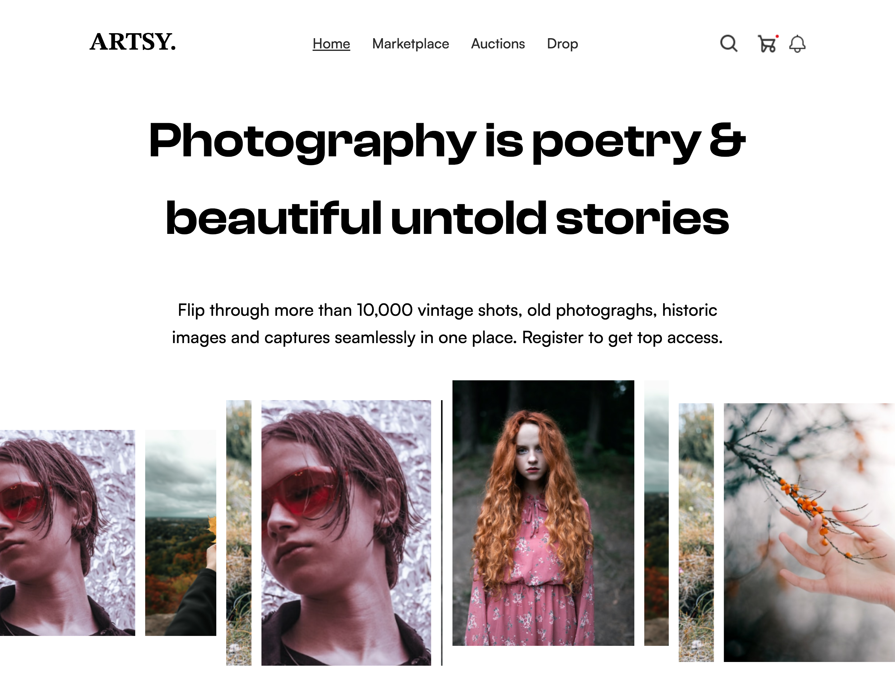

# ARTSY
`Frontend Development` `Web Development` `Viking` `Baby dev` `challenge`

|Challenge: | coding360challenge                                |
|:----------|:--------------------------------------------------|
|Hosted by: | [codingossy](https://twitter.com/codingossy)      |
|Group:     | Baby dev/Viking                                   |
|Duration:  | Dec 1st 2022 - Dec 31st 2022                      |
|Sponsor:   | [BasitDevelops](https://twitter.com/BasitDevelops)|
|Designer:  | [celestinaa0](https://twitter.com/celestinaa0)    |
|Live view: | [artsybymide.netlify.app](https://artsybymide.netlify.app/)|
|Community: | [Tech360](https://twitter.com/i/communities/1534272865725472770)|

## Prototype

## Technologies

- HTML5
- TailwindCSS
- JavaScript(Eslint validated)
- Swiper Js
- NPM
- Google Fonts
- Fontshare

## Requirement

- responsiveness is a must
- clean codes
- use semantics
- comment on your codes
- proper documentation
- attention to detail
- use animations (where u can)

## General

- [Live view](https://artsybymide.netlify.app/)
- [Figma link](https://www.figma.com/file/18hZ5n19imr8RxmzwXUtKK/ARTSY?node-id=302%3A119&t=mkbfAHKhY0dCptfM-1)
- [Challenge announcement](https://twitter.com/codingossy/status/1598218445069639681)
- [Follow me on twitter](https://github.com/codewithmide)
